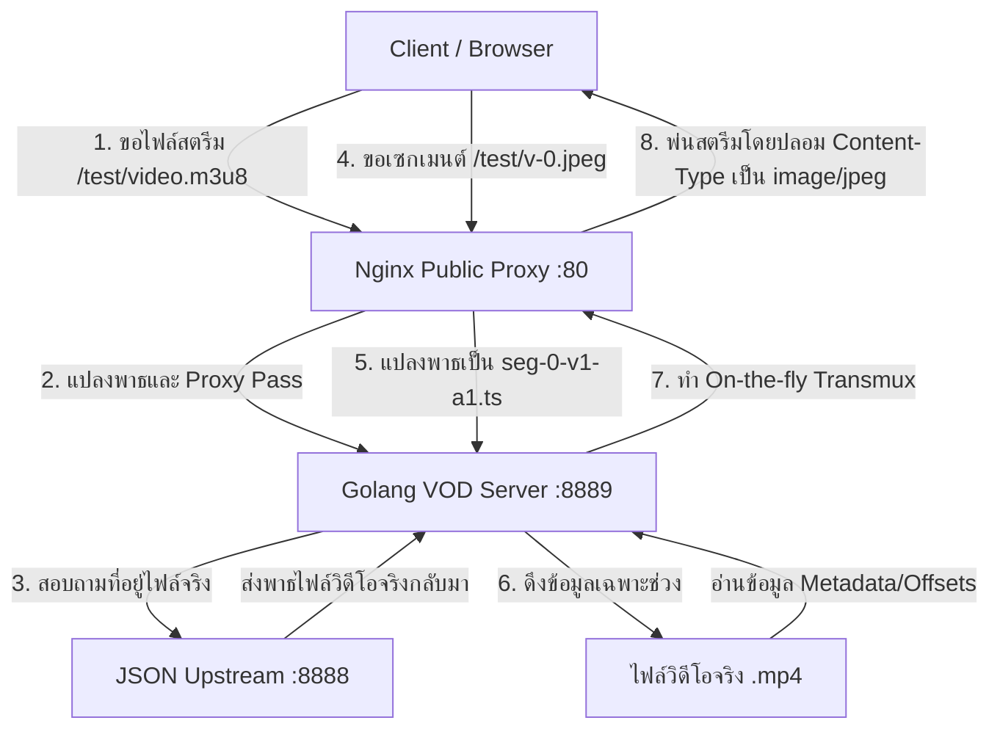

# Golang VOD Module (Standalone HLS/DASH Transmuxer)

โปรแกรมสำหรับทำหน้าที่แปลงตู้คอนเทนเนอร์ของไฟล์วิดีโอ MP4 (H.264/AAC) เป็นสตรีม HLS และ DASH แบบเรียลไทม์ (On-the-fly Transmuxing) ซึ่งเขียนขึ้นด้วยภาษา Go (Golang) ล้วน เพื่อใช้เป็นโมดูลทดแทนตัวดั้งเดิมที่เป็นภาษา C (`nginx-vod-module`) ของ Kaltura ในโครงการ **VdoHide**

---

## สถาปัตยกรรมระบบ (System Architecture)

เซิร์ฟเวอร์ Go นี้จะทำหน้าที่เป็นเบื้องหลัง (Backend Service) รันอยู่ที่พอร์ต `8889` โดยทำงานร่วมกับ Nginx (พอร์ต `80`) ที่อยู่ด้านหน้าสุดเพื่อทำหน้าที่เป็น Obfuscation Layer คอยพรางไฟล์ข้อมูลเซกเมนต์เป็นไฟล์รูปภาพ `.jpeg` เพื่อเพิ่มความปลอดภัยและหลบเลี่ยงการบล็อก/ตรวจสอบสตรีมวิดีโอ



---

## คุณสมบัติหลัก (Features)

*   **100% Pure Go**: ไม่มี Dependencies ระดับ C (CGo/FFmpeg) ติดตั้งใช้งานง่าย รวดเร็ว และไม่มีสิทธิ์เกิด Segment Fault จากความเข้ากันไม่ได้ของระบบไลบรารี
*   **Mapped Mode**: รองรับการดึงรายละเอียดโครงสร้างไฟล์วิดีโอผ่าน JSON API Server ตามโครงสร้างของ `vdohide-core`
*   **HLS Streaming (MPEG-TS & fMP4)**:
    *   สร้างไฟล์ดัชนี Master Playlist และ Media Playlist (`index-v1-a1.m3u8`)
    *   Mux สัญญาณเป็นไฟล์ย่อย MPEG-TS (`seg-{num}-v1-a1.ts`) พร้อมการจัดการคีย์เฟรมและเวลาเสียง/ภาพที่ตรงกัน (Interleaving)
    *   รองรับเซกเมนต์แบบ Fragmented MP4 (fMP4)
*   **DASH Streaming**: สร้างไฟล์ Manifest (`manifest.mpd`) และประกอบสตรีมย่อย fMP4 (`.m4s`)
*   **VdoHide Obfuscation Ready**: ออกแบบมารองรับการแปลงชื่อไฟล์เซกเมนต์เพื่ออำนวยความสะดวกในการทำภาพลวงตาผ่าน Nginx (เช่น เปลี่ยนจากสตรีม .ts มาเป็นนามสกุลรูปภาพ `.jpeg`)
*   **In-Memory Metadata Cache**: แคชข้อมูลหัวโครงสร้างอะตอม (Atoms/Boxes) และพิกัด Keyframes ของไฟล์ MP4 ในหน่วยความจำ ช่วยให้อ่านและตอบเซกเมนต์ถัดไปของวิดีโอได้อย่างรวดเร็วโดยไม่ต้องวนเปิดสแกนไฟล์ MP4 ขนาดใหญ่ใหม่ทุกครั้งที่ดักขอเซกเมนต์

---

## โครงสร้างโปรเจกต์ (Project Structure)

```
go-vod-module/
├── config.json           # ไฟล์ตั้งค่าพอร์ตและ JSON Upstream หลัก
├── go.mod                # ข้อมูลจัดการ Dependency ของ Go
├── go.sum                # ข้อมูลยืนยันความปลอดภัย Dependency
├── cmd/
│   └── main.go           # จุดเริ่มต้นของระบบ (Entrypoint)
└── internal/
    ├── config/           # ระบบอ่านและโหลดการตั้งค่าระบบ
    ├── mp4/              # ตัวสแกน/วิเคราะห์โครงสร้างไฟล์วิดีโอ MP4 ค้นหาแทร็กและตำแหน่งคีย์เฟรม
    ├── hls/              # ระบบสร้าง Playlist HLS และตัวประกอบ MPEG-TS/fMP4 Muxer
    ├── dash/             # ระบบสร้าง DASH Manifest (.mpd) และโครงสร้าง fMP4 Segmenter
    └── server/           # ระบบ HTTP Server, เส้นทาง (Routing) และระบบจัดการ Metadata แคช
```

---

## โครงสร้าง API Endpoints

### 1. ระบบทั่วไป (General)
*   `GET /healthz` - ใช้ตรวจสอบสถานะการทำงานของบริการ (ส่งข้อความตอบกลับเป็น `ok\n` พอร์ต HTTP `200`)

### 2. บริการ HLS Stream (`/hls/`)
*   `GET /hls/{filename}/master.m3u8` - ดึงไฟล์ดัชนีหลักสำหรับเครื่องเล่นเพื่อเลือกคุณภาพ
*   `GET /hls/{filename}/index-v1-a1.m3u8` - ดึงเพลย์ลิสต์แสดงรายชื่อเซกเมนต์จริง
*   `GET /hls/{filename}/seg-{num}-v1-a1.ts` - ดาวน์โหลดเซกเมนต์ข้อมูลวิดีโอ/เสียงในรูปแบบ MPEG-TS (เริ่มนับเซกเมนต์แรกที่ `0`)
*   `GET /hls/{filename}/init-{track}.mp4` - ดาวน์โหลดดัชนีเซกเมนต์เริ่มต้นในรูปแบบ HLS-fMP4 (เช่น `init-v1.mp4`, `init-a1.mp4`)
*   `GET /hls/{filename}/seg-{num}.m4s` - ดาวน์โหลดเซกเมนต์วิดีโอ/เสียงสำหรับ HLS-fMP4

### 3. บริการ DASH Stream (`/dash/`)
*   `GET /dash/{filename}/manifest.mpd` - ดึงไฟล์ XML แสดงโครงสร้าง DASH Manifest
*   `GET /dash/{filename}/init-{track}.mp4` - ไฟล์เริ่มต้นข้อมูลเสียงหรือภาพ (เช่น `init-v1.mp4` หรือ `init-a1.mp4`)
*   `GET /dash/{filename}/seg-{num}-{track}.m4s` - ไฟล์เซกเมนต์สำหรับ DASH (เริ่มนับเซกเมนต์แรกที่ `1`)

---

## การตั้งค่าใช้งาน (`config.json`)

แก้ไขค่าต่าง ๆ ได้จากไฟล์ `config.json` ซึ่งควรเก็บไว้ในโฟลเดอร์เดียวกับตัวโปรแกรมที่รันอยู่:

```json
{
  "port": 8889,
  "mode": "local",
  "media_root": "D:/xxx",
  "upstream_json_url": "http://127.0.0.1:8888",
  "default_segment_duration": 4000,
  "max_cache_entries": 1000,
  "align_segments_to_key_frames": false
}
```

*   `port`: หมายเลขพอร์ตที่เซิร์ฟเวอร์ Go จะเปิดให้บริการ (ค่าเริ่มต้นคือ `8889`)
*   `mode`: โหมดการทำงานของเซิร์ฟเวอร์ มี 2 โหมดคือ `"local"` (อ่านไฟล์วิดีโอจากโฟลเดอร์เครื่องตรง ๆ ตาม `media_root`) และ `"mapped"` (สอบถามเส้นทางวิดีโอจริงผ่าน API Upstream)
*   `media_root`: โฟลเดอร์หลักที่ใช้จัดเก็บไฟล์วิดีโอในเครื่อง (ใช้เฉพาะในโหมด `"local"`)
*   `upstream_json_url`: ลิงก์ปลายทางส่งไปขอรับรายละเอียดของวิดีโอ (Mapping JSON) ผ่านตัวระบบ Core (ใช้เฉพาะในโหมด `"mapped"`)
*   `default_segment_duration`: ความยาวเริ่มต้นที่ต้องการตัดย่อยของแต่ละเซกเมนต์วิดีโอ (หน่วยเป็นมิลลิวินาที, เช่น `4000` มิลลิวินาที หรือ 4 วินาที)
*   `max_cache_entries`: จำนวนไฟล์วิดีโอสูงสุดที่ต้องการบันทึกแคชอะตอม/คีย์เฟรมในหน่วยความจำ RAM (ค่าเริ่มต้นคือ `1000` แต่อาจปรับลงเหลือ `100-200` บนเซิร์ฟเวอร์ที่มีแรมน้อย)
*   `align_segments_to_key_frames`: บังคับให้เริ่มแต่ละเซกเมนต์ HLS ด้วย Keyframe (IDR Frame) เสมอ (แนะนำให้ตั้งเป็น `true` บน Production เพื่อป้องกันปัญหาการสะดุดหรือจอดำขณะผู้เล่นกด Seeking)

---

## การคอมไพล์ระบบ (Build & Compilation)

### 1. คอมไพล์โปรแกรมสำหรับรันบน Windows (ทดสอบเครื่องตัวเอง)
สั่งรันสคริปต์ `build.bat` เพื่อทำการคอมไพล์และสำเนาไฟล์คอนฟิกไปยังโฟลเดอร์ `.build/` โดยอัตโนมัติ:
```cmd
build.bat
```
หรือใช้คำสั่ง Go โดยตรง:
```bash
go build -o server.exe ./cmd
```


### 2. คอมไพล์ระบบเพื่อนำไปใช้บน Linux Server (Cross-Compilation)
สั่งการผ่าน Windows PowerShell เพื่อสร้างไบนารีสำหรับนำไปรันบนระบบปฏิบัติการลินุกซ์:
```powershell
$env:GOOS="linux"
$env:GOARCH="amd64"
go build -o server ./cmd
```

---

## การติดตั้งในลักษณะ Service บนลินุกซ์ (Linux Systemd Integration)

เพื่อนำระบบ Go ไปเปิดรันแบบเบื้องหลัง (Background Daemon) บนระบบลินุกซ์แทนโมดูล C เก่า สามารถสร้างไฟล์ Service ได้ดังนี้:

1. สร้างไฟล์ระบบที่ `/etc/systemd/system/golang-vod.service`:
```ini
[Unit]
Description=Golang VOD Module (VdoHide)
After=network.target

[Service]
Type=simple
User=www-data
WorkingDirectory=/opt/golang-vod
ExecStart=/opt/golang-vod/server
Restart=on-failure
RestartSec=5
LimitNOFILE=65535

[Install]
WantedBy=multi-user.target
```

2. นำไฟล์โปรแกรมและคอนฟิกไปวางไว้ที่ตำแหน่งที่ระบุ:
```bash
mkdir -p /opt/golang-vod
cp server /opt/golang-vod/
cp config.json /opt/golang-vod/
chown -R www-data:www-data /opt/golang-vod
```

3. สั่งโหลดระบบ ปิดโปรแกรมเดิมเปิดใช้บริการใหม่:
```bash
# ปิดบริการ VOD Nginx Module ตัวเก่า (ถ้ามี)
systemctl stop nginx-vod || true
systemctl disable nginx-vod || true

# เริ่มใช้งาน Golang VOD
systemctl daemon-reload
systemctl enable golang-vod
systemctl start golang-vod
```

---

## การกำหนดค่า Nginx Proxy และการอำพรางข้อมูล (Obfuscation Configuration)

นี่คือตัวอย่างคอนฟิก Nginx บนเซิร์ฟเวอร์หลัก (พอร์ต `80`) ที่ใช้เชื่อมต่อและสลับมาใช้บริการของเซิร์ฟเวอร์ Go นี้ พร้อมระบบอำพรางวิดีโอเป็นรูปภาพ JPEG:

```nginx
# ตัวอย่างคอนฟิกส่วนการพรางไฟล์ใน /etc/nginx/conf.d/local.conf

server {
  listen 80;
  server_name _;

  # 1. การเรียกขอเพลย์ลิสต์หลัก (ย้ายมาดึงจาก Go พอร์ต 8889)
  location ~ ^/([^/]+)/master\.m3u8$ {
    proxy_http_version 1.1;
    proxy_set_header Connection "";
    proxy_set_header Host $host;
    proxy_set_header Accept-Encoding "";
    proxy_pass http://127.0.0.1:8889/hls/$1.json/master.m3u8;

    # สแกนแทนที่พาธภายใน m3u8
    sub_filter_types application/vnd.apple.mpegurl;
    sub_filter '/hls/' '/';
    sub_filter '.json/index-v1-a1.m3u8' '/video.m3u8';
    sub_filter_once off;
  }

  # 2. การเรียกขอ Media Playlist
  location ~ ^/([^/]+)/video\.m3u8$ {
    proxy_http_version 1.1;
    proxy_set_header Connection "";
    proxy_set_header Host $host;
    proxy_set_header Accept-Encoding "";
    proxy_pass http://127.0.0.1:8889/hls/$1.json/index-v1-a1.m3u8;

    # อำพรางสตรีมเซกเมนต์ TS ในเพลย์ลิสต์ให้กลายเป็นนามสกุลภาพ (.jpeg)
    sub_filter_types application/vnd.apple.mpegurl;
    sub_filter '/hls/' '/';
    sub_filter '.json/seg-' '/v-';
    sub_filter '-v1-a1.ts' '.jpeg';
    sub_filter_once off;
  }

  # 3. จุดบริการแปลงและอำพรางทราฟฟิกข้อมูล (v-X.jpeg -> seg-X-v1-a1.ts)
  location ~ ^/([^/]+)/v-(\d+)\.jpeg$ {
    # จำกัดแบนด์วิธป้องกันการดาวน์โหลดหนักเกินไป
    limit_rate 3m;
    limit_rate_after 100k;

    proxy_http_version 1.1;
    proxy_set_header Connection "";
    proxy_set_header Host $host;
    proxy_pass http://127.0.0.1:8889/hls/$1.json/seg-$2-v1-a1.ts;

    # ซ่อน header สตรีมและหลอกให้บราวเซอร์คิดว่าเป็นรูปภาพจริงๆ
    proxy_hide_header Content-Type;
    proxy_hide_header Cache-Control;
    proxy_hide_header Expires;
    proxy_hide_header last-modified;
    
    add_header Content-Type 'image/jpeg' always;
    add_header Accept-Ranges 'bytes' always;
    add_header Cache-Control 'public, max-age=31536000, immutable' always;
    add_header Vary 'Accept-Encoding' always;
  }
}
```

---

## การทดสอบระบบ (Testing)

คุณสามารถทดสอบการทำงานของฟังก์ชันต่าง ๆ ภายในระบบโดยสั่งรันผ่าน CLI ของ Go:

```bash
# รันการทดสอบทั้งหมดของแพ็กเกจภายในระบบ
go test ./... -v
```
